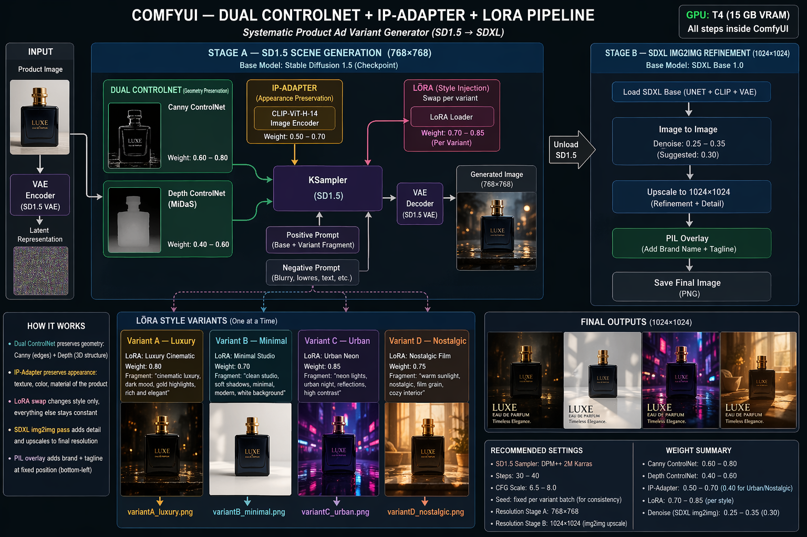

# AI Morph Ads

Generate **four psychologically-distinct ad creatives** from **one product image**, using a ComfyUI pipeline built on
SD1.5 + dual ControlNet + IP-Adapter + LoRA swap, with an SDXL base img2img refinement pass.

| Variant   | Mood           | What it does                                             |
|-----------|----------------|----------------------------------------------------------|
| Luxury    | Aspiration     | Cinematic low-key lighting, gold accents, marble/velvet  |
| Minimal   | Trust          | Clean studio, soft shadows, scandinavian palette         |
| Urban     | Energy / youth | Neon night street, magenta/cyan, reflective wet pavement |
| Nostalgic | Warmth         | Golden hour, film grain, 1970s interior                  |

The same product stays consistent across all four — that's what IP-Adapter + dual ControlNet are doing. Only the LoRA
and per-variant prompt change.

---

## Project structure

```
AI Morph Ads/
├── README.md                   # this file — setup + usage
├── readme-proposal.md          # original proposal (v1.1, technically revised)
├── readme-explanation.md       # Russian walkthrough of how each node works
├── requirements.txt            # orchestration-side Python deps
├── .gitignore
│
├── configs/
│   └── variants.yaml           # 4 variants: prompts, LoRAs, weights, overlay settings
│
├── workflows/
│   └── ai_morph_ads.json       # ComfyUI API-format workflow (single variant, parameterized)
│
├── scripts/
│   ├── download_models.py      # pulls SD1.5, SDXL base, ControlNets, IP-Adapter, CLIP-Vision
│   ├── run_pipeline.py         # driver: submits workflow to ComfyUI /prompt 4 times
│   └── text_overlay.py         # PIL brand + tagline stamp (called by run_pipeline.py)
│
├── notebooks/
│   └── colab_setup.ipynb       # one-click Colab / Kaggle runner (T4 GPU)
│
├── assets/
│   ├── pipeline_schema.png     # pipeline architecture diagram
│   └── fonts/                  # drop .ttf/.otf here; gitignored
│
├── inputs/                     # your product images go here
└── outputs/                    # generated ads (raw + overlayed) land here
```

The `ComfyUI/` folder is **not** in this repo — it's cloned at setup time (or by the Colab notebook), and its `models/`
subfolder is populated by `scripts/download_models.py`.

---

## Technical Approach



The pipeline runs entirely inside ComfyUI on a T4 GPU (15 GB VRAM). It is split into two sequential stages to stay within the VRAM budget.

---

### Stage A — SD1.5 scene generation (768×768)

This stage constructs the base scene. SD1.5 is used together with ControlNet, IP-Adapter, and LoRA, producing a 768×768 image.

At this stage the model is responsible for scene composition, pose, and overall structure of objects, as well as forming a rough visual concept. ControlNet captures geometry and shape (Canny, Depth), IP-Adapter adds visual references and locks appearance, and LoRA steers the artistic direction. SD1.5 is used here because it is lighter on VRAM, runs faster, and is more stable for building the image "skeleton."

---

### Stage B — SDXL base img2img refinement (1024×1024)

This stage handles enhancement and detailing. SDXL runs in img2img mode; the result is upscaled to 1024×1024.

SDXL does not generate from scratch — it takes the Stage A output (768×768), converts it to latent space via VAE, and performs generation with a low denoising strength of ~0.30. This is not a simple resolution increase or image stretch, but a generative reworking: the model preserves overall structure while redrawing details, improving textures, and adding realism at 1024×1024.

A denoising strength of ~0.30 is key: it lets the Stage A structure survive intact while giving SDXL room to "polish" lighting, detail, and visual quality without altering the scene's foundation.

---

### Why a latent-space pipeline?

The product image enters through a VAE encoder, converting it into a latent representation that all downstream nodes operate on. Working in latent space is what allows scene generation and style changes without losing the product's core shape and colour identity.

---

### Geometry preservation — dual ControlNet

Product edges and structure are preserved using two ControlNets applied simultaneously:

- **Canny ControlNet** — extracts hard edges (bottle silhouette, product contours).
- **Depth ControlNet (MiDaS)** — extracts the 3D depth map (foreground / background separation).

Both signals feed into the KSampler, constraining generation to respect product geometry regardless of what scene is generated around it.

| ControlNet | Suggested weight |
|---|---|
| Canny | 0.60 – 0.80 |
| Depth | 0.40 – 0.60 |

---

### Appearance preservation — IP-Adapter

Where ControlNet constrains geometry, IP-Adapter constrains appearance. IP-Adapter encodes the product's texture, colour, and material properties via a CLIP-ViT-H-14 image encoder and injects them as conditioning into SD1.5 cross-attention layers. This ensures the bottle still looks like *that specific bottle* across all four outputs.

Suggested IP-Adapter weight: **0.5 – 0.7**. For variants where scene atmosphere should dominate (Urban, Nostalgic), drop to **0.4**.

---

### Style switching — LoRA swap

Style is injected via a LoRA swap. Four style LoRAs (sourced from CivitAI) are loaded one at a time, each biasing generation toward a different aesthetic:

| Variant | Aesthetic | Typical LoRA weight |
|---|---|---|
| Luxury | Cinematic dark, gold highlights | 0.80 |
| Minimal | Clean studio, soft shadows | 0.70 |
| Urban | Neon night, high contrast | 0.85 |
| Nostalgic | Warm film grain, sunlit interiors | 0.75 |

The base prompt, ControlNet signals, and IP-Adapter conditioning are **identical** across all four runs — only the LoRA and per-variant prompt fragment change. This is what makes the system a systematic variant factory rather than random prompting.

---

### Final pass — SDXL base img2img + PIL overlay

After KSampler generation at SD1.5 / 768², the pipeline decodes to pixels, unloads SD1.5, loads SDXL base, and runs a single img2img pass at denoise 0.25–0.35 targeting 1024×1024. This sharpens detail and compensates for SD1.5's known weakness at high resolution, without regenerating the scene.

PIL post-processing then overlays brand name + tagline at a fixed ad-safe position (bottom-left by default). All four final images are saved with a prefix per variant (`variantA_luxury.png`, `variantB_minimal.png`, …).

> For a node-by-node walkthrough of every ComfyUI node, see [`readme-explanation.md`](./readme-explanation.md).

---

## Requirements

- **GPU:** NVIDIA with ≥ 12 GB VRAM. Tested on T4 (15 GB, Colab / Kaggle).
- **Python:** 3.10 or 3.11
- **OS:** Linux or Windows (WSL2 works). Mac users can run ComfyUI on MPS but IP-Adapter + SDXL may be slow.
- **Disk:** ~15 GB for all model weights + LoRAs.

---

## Launch scenarios

There are three ways to run the project. Pick the one that matches your situation.

---

### Scenario 1 — Google Colab / Kaggle (free cloud GPU, no local setup)

**When to use:** you don't have a local GPU, or you want a fully automated one-click run.

**What happens:** everything lives in the cloud session. Models download to the Colab VM (~10 GB), outputs appear inline
in the notebook. **Nothing downloads to your computer** unless you explicitly copy files or mount Google Drive.

**Steps:**

1. Open [Google Colab](https://colab.research.google.com) or [Kaggle](https://www.kaggle.com/code).
2. Upload this whole project folder (or clone it from your GitHub fork) into the cloud filesystem at
   `/content/AI Morph Ads/`.
3. Open `notebooks/colab_setup.ipynb`.
4. Switch runtime to **GPU (T4)**: *Runtime → Change runtime type → T4 GPU*.
5. Run all cells top-to-bottom. The notebook will:
    - Clone ComfyUI + 3 required custom nodes
    - Install all Python deps
    - Download model weights via `scripts/download_models.py` (into the Colab VM, not your PC)
    - Ask you to upload 4 style LoRAs and your product image
    - Start ComfyUI as a background server (`--medvram`, port 8188)
    - Call `scripts/run_pipeline.py` to generate 4 variants
    - Display the results inline
6. To **keep the outputs**, download the 4 PNGs manually from the Colab file browser, or add a cell to copy them to
   mounted Google Drive.

> Colab free tier: ~4 h T4 per session — enough for multiple full runs. Kaggle: 30 GPU-hrs/week, no idle timeout —
> better for iterative work.

**ComfyUI UI in Colab:** ComfyUI runs headless in the background — you don't see its browser interface. The pipeline is
driven entirely by the script. If you want the visual UI in Colab, you need a tunnel (e.g. `--listen 0.0.0.0` + Colab's
port-forwarding), but that's not necessary for normal use.

---

### Scenario 2 — Local machine, headless (CLI only, no ComfyUI UI)

**When to use:** you have a local GPU and want fully automated, scriptable runs. This is the fastest workflow — no
browser involved.

**What happens:** everything stays on your machine. ComfyUI runs as a background server you never look at; the scripts
drive it via HTTP.

**Steps:**

**1. Clone ComfyUI next to this project folder**

```bash
# run this in the parent directory that contains "AI Morph Ads/"
git clone --depth 1 https://github.com/comfyanonymous/ComfyUI.git
pip install -r ComfyUI/requirements.txt
```

**2. Install the three required custom nodes**

```bash
cd ComfyUI/custom_nodes
git clone https://github.com/ltdrdata/ComfyUI-Manager.git
git clone https://github.com/cubiq/ComfyUI_IPAdapter_plus.git
git clone https://github.com/Fannovel16/comfyui_controlnet_aux.git

pip install -r ComfyUI-Manager/requirements.txt
pip install -r ComfyUI_IPAdapter_plus/requirements.txt
pip install -r comfyui_controlnet_aux/requirements.txt
cd ../..
```

**3. Install this project's Python deps**

```bash
cd "AI Morph Ads"
pip install -r requirements.txt
```

**4. Download all model weights** (~10 GB, one-time)

```bash
python scripts/download_models.py --comfy-root ../ComfyUI
```

This fetches into `../ComfyUI/models/...`:

| File                                          | Folder         |
|-----------------------------------------------|----------------|
| `v1-5-pruned-emaonly.safetensors`             | `checkpoints/` |
| `sd_xl_base_1.0.safetensors`                  | `checkpoints/` |
| `vae-ft-mse-840000-ema-pruned.safetensors`    | `vae/`         |
| `control_v11p_sd15_canny.pth`                 | `controlnet/`  |
| `control_v11f1p_sd15_depth.pth`               | `controlnet/`  |
| `ip-adapter-plus_sd15.safetensors`            | `ipadapter/`   |
| `CLIP-ViT-H-14-laion2B-s32B-b79K.safetensors` | `clip_vision/` |

After it finishes the script **prints 4 LoRA filenames** you need to add manually — grab matching style LoRAs from
CivitAI and place them in `../ComfyUI/models/loras/`, or update the filenames in `configs/variants.yaml`.

**5. Start ComfyUI in a separate terminal** (leave it running)

```bash
cd ../ComfyUI
python main.py --listen 127.0.0.1 --port 8188 --medvram
```

**6. Run the pipeline**

```bash
cd "../AI Morph Ads"
python scripts/run_pipeline.py \
    --product inputs/your_product.png \
    --brand "NOIR" \
    --tagline "Timeless." \
    --product-name "perfume bottle"
```

Outputs land in `outputs/`: four `*.png` creatives + four `*_raw.png` pre-overlay versions. Total time on T4: ~2–3 min.

---

### Scenario 3 — Local machine with ComfyUI visual UI (manual / exploratory)

**When to use:** you want to open ComfyUI in the browser, tweak nodes visually, experiment with the workflow, or debug
individual generations.

**Important:** `workflows/ai_morph_ads.json` is in **API format** — it cannot be loaded directly via the ComfyUI UI's "
Load" button. To work visually you have two options:

**Option A — build the workflow visually from scratch** in ComfyUI, referencing `readme-explanation.md` for the node
structure, then save it as a UI workflow. This gives you a draggable canvas.

**Option B — use the API workflow as-is but inspect it in the UI:**

1. Follow steps 1–5 from Scenario 2 to get ComfyUI running.
2. Open `http://127.0.0.1:8188` — you'll see the ComfyUI canvas.
3. In the ComfyUI menu: *Settings → Enable Dev mode options*, then use the "Load API format" button to import
   `workflows/ai_morph_ads.json`. Nodes will appear without visual positions (stacked), but you can rearrange them.
4. Manually set `lora_name`, `positive prompt`, etc. in the node fields.
5. Click **Queue Prompt** — the output goes to `ComfyUI/output/`.

> In this scenario `configs/variants.yaml` and `scripts/run_pipeline.py` are **not used** — you're driving everything
> manually through the UI.

**When to use each scenario:**

|                 | Scenario 1 (Colab)           | Scenario 2 (Local CLI)      | Scenario 3 (Local UI)          |
|-----------------|------------------------------|-----------------------------|--------------------------------|
| GPU             | Free cloud T4                | Your local GPU              | Your local GPU                 |
| Setup effort    | Low (notebook handles it)    | Medium (one-time CLI setup) | Medium + manual node wiring    |
| Output location | Colab VM (download manually) | `outputs/` on your disk     | `ComfyUI/output/` on your disk |
| Automation      | Full (4 variants auto)       | Full (4 variants auto)      | Manual (one variant at a time) |
| Visual canvas   | No                           | No                          | Yes                            |
| Best for        | First run, no local GPU      | Repeatable production runs  | Debugging / experimentation    |

---

## About `workflows/ai_morph_ads.json`

This file is the ComfyUI workflow in **API format** — a flat JSON where each key is a node ID and each value is the
node's class and input connections. It is **not** the visual `.json` you'd get by clicking "Save" in the ComfyUI UI (
which includes canvas positions and extra metadata).

**How `run_pipeline.py` uses it:**

```
variants.yaml          ai_morph_ads.json
     │                       │
     │  (read 4 variants)    │  (load template once)
     └──────────┬────────────┘
                ▼
        patch {{placeholders}}
        (lora, prompt, weights, image path, …)
                ▼
        POST /prompt → ComfyUI
                ▼
        poll websocket until done
                ▼
        GET /view → download PNG to outputs/
```

`run_pipeline.py` repeats this loop 4 times, once per entry in `variants:` in `variants.yaml`. The placeholders that get
substituted are:

| Placeholder                                     | Source                                                              |
|-------------------------------------------------|---------------------------------------------------------------------|
| `{{sd15_checkpoint}}`                           | `shared.sd15_checkpoint` in variants.yaml                           |
| `{{sd15_vae}}`                                  | `shared.sd15_vae`                                                   |
| `{{sdxl_checkpoint}}`                           | `shared.sdxl_checkpoint`                                            |
| `{{controlnet_canny}}` / `{{controlnet_depth}}` | `shared.controlnet_*`                                               |
| `{{ipadapter_model}}` / `{{clip_vision}}`       | `shared.ipadapter_model` / `shared.clip_vision`                     |
| `{{lora}}`                                      | `variants[i].lora`                                                  |
| `{{lora_weight}}`                               | `variants[i].lora_weight`                                           |
| `{{ipadapter_weight}}`                          | `variants[i].ipadapter_weight` (or shared default)                  |
| `{{positive_prompt}}`                           | `variants[i].prompt` with `{brand}` and `{product}` filled from CLI |
| `{{negative_prompt}}`                           | `shared.negative_prompt`                                            |
| `{{product_image}}`                             | `--product` CLI argument                                            |
| `{{seed}}`                                      | auto-generated per variant (shared base + offset)                   |

**You should never need to edit `ai_morph_ads.json` directly.** All tunable parameters are exposed through
`configs/variants.yaml`. Only edit the JSON if you want to add or remove nodes from the pipeline itself.

**If you want to import it into the ComfyUI visual UI:** go to *Settings → Enable Dev mode options* in ComfyUI, then use
the "Load API format" button. The nodes will appear without x/y positions (stacked at the origin) — you'll need to
rearrange them manually on the canvas.

---

## Customizing

All tunable knobs are in **one file**: [`configs/variants.yaml`](./configs/variants.yaml).

- **Add / rename variants:** edit the `variants:` list — each entry is independent.
- **Change prompts:** edit the `prompt:` field. `{brand}` and `{product}` placeholders get filled from the CLI args.
- **Swap LoRAs:** drop new `.safetensors` files into `ComfyUI/models/loras/` and update `lora:` fields.
- **Rebalance geometry vs. creativity:** change `controlnet.canny_strength` / `depth_strength` under `shared:`.
- **Rebalance identity vs. scene freedom:** change `ipadapter_weight` per variant.
- **Change text overlay:** edit `shared.overlay` (font, size, position, color, shadow).

No workflow JSON edits are needed for any of the above.

---

## Troubleshooting

- **`CUDA out of memory`** — add `--medvram` or `--lowvram` to the ComfyUI launch command. The pipeline is designed
  around two sequential stages (SD1.5 then SDXL) for exactly this reason on T4-class cards.
- **`ModuleNotFoundError: websocket`** — `pip install websocket-client` (it's `websocket-client`, not `websocket`; both
  are listed in `requirements.txt`).
- **`IPAdapter` nodes not found** — the `ComfyUI_IPAdapter_plus` custom node isn't installed, or ComfyUI didn't restart
  after you installed it.
- **`CannyEdgePreprocessor` / `MiDaS-DepthMapPreprocessor` not found** — `comfyui_controlnet_aux` isn't installed.
- **Product identity drifts between variants** — raise `ipadapter_weight` to 0.7–0.8 for that variant.
- **All four variants look the same** — your LoRA isn't loading (wrong filename in `variants.yaml`) or its `lora_weight`
  is too low (raise to 0.8–0.9).
- **Product shape is lost** — raise `canny_strength` to 0.8 and/or `depth_strength` to 0.6.

---

## Model sources + licenses

| Artifact                      | Source                                                                                                      | License                |
|-------------------------------|-------------------------------------------------------------------------------------------------------------|------------------------|
| SD1.5 base                    | [runwayml/stable-diffusion-v1-5](https://huggingface.co/runwayml/stable-diffusion-v1-5)                     | CreativeML Open RAIL-M |
| SDXL base 1.0                 | [stabilityai/stable-diffusion-xl-base-1.0](https://huggingface.co/stabilityai/stable-diffusion-xl-base-1.0) | OpenRAIL++-M           |
| VAE ft-mse-840k               | [stabilityai/sd-vae-ft-mse-original](https://huggingface.co/stabilityai/sd-vae-ft-mse-original)             | MIT                    |
| ControlNet Canny / Depth v1.1 | [lllyasviel/ControlNet-v1-1](https://huggingface.co/lllyasviel/ControlNet-v1-1)                             | OpenRAIL               |
| IP-Adapter Plus (SD1.5)       | [h94/IP-Adapter](https://huggingface.co/h94/IP-Adapter)                                                     | Apache-2.0             |
| CLIP-ViT-H-14-laion2B         | bundled with IP-Adapter repo                                                                                | MIT                    |
| Style LoRAs                   | [CivitAI](https://civitai.com)                                                                              | varies per model       |

Each LoRA on CivitAI has its own license — check each one before using outputs commercially.

---

## What's "under the hood" — in one diagram

```
product.png ─┬─► Canny preproc ──► ControlNet(canny, 0.75) ─┐
             ├─► MiDaS depth  ──► ControlNet(depth, 0.50) ──┤
             └─► CLIP-Vision ──► IP-Adapter (0.5–0.7) ──┐    │
                                                        ▼    ▼
  variant prompt ──► SD1.5 [+LoRA] ──► KSampler ──► VAE decode (768²)
                                                          │
                                                          ▼
                                      ImageScale ──► VAE encode (SDXL)
                                                          │
                                                          ▼
                         SDXL base ──► KSampler img2img (denoise 0.30)
                                                          │
                                                          ▼
                                               VAE decode (1024²)
                                                          │
                                                          ▼
                                             PIL text overlay
                                                          │
                                                          ▼
                                        outputs/<variant>.png
```

Run it 4 times with different LoRAs + prompts → 4 consistent, psychologically-distinct ad creatives from 1 product
photo.
